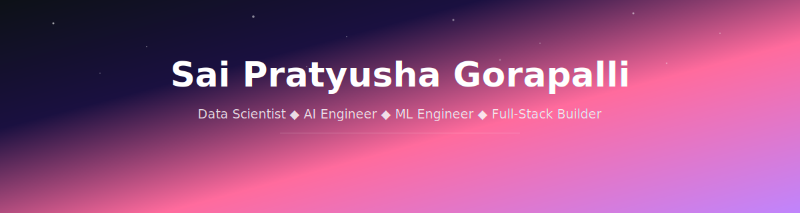

<picture>
  <source media="(prefers-color-scheme: dark)" srcset="assets/header-dark.svg" />
  <source media="(prefers-color-scheme: light)" srcset="assets/header-light.svg" />
  
</picture>

<p align="center">
  <a href="https://pratyusha108.github.io"></a>&nbsp;
  <a href="https://www.linkedin.com/in/pratyusha-g-a92915229/"></a>&nbsp;
  <a href="mailto:saipratyushagorapalli333@gmail.com"></a>&nbsp;
  <a href="https://www.kaggle.com/saipratyushagorapalli"></a>&nbsp;
  <a href="https://leetcode.com/u/sai_pratyusha_gorapalli/"></a>&nbsp;
  <a href="https://huggingface.co/pratyushagorapalli"></a>&nbsp;
  
</p>

<p align="center">
  
</p>

---

```python
class Pratyusha:
    role      = "Data Scientist | AI Engineer | ML Engineer"
    education = ["M.S. Data Analytics - Webster University",
                 "MBA - Technology Management",
                 "B.E. - Electrical & Electronics"]
    focus     = ["AI Agents & LLM Engineering", "Predictive Analytics",
                 "Time Series Forecasting", "Azure MLOps",
                 "NLP & Transformers", "Data Storytelling"]
    strengths = ["Question everything", "EDA-first methodology",
                 "Research-grade rigor", "Ship real products"]
    building  = "AI agents that do in minutes what takes hours manually"
```

---

<h3 align="center">Tech Stack</h3>

<p align="center">
  <picture>
  <source media="(prefers-color-scheme: dark)" srcset="https://skillicons.dev/icons?i=py,r,java,cpp,tensorflow,pytorch,azure,docker,postgres,mysql,react,nodejs,git,github,vscode,linux&perline=8&theme=dark" />
  <source media="(prefers-color-scheme: light)" srcset="https://skillicons.dev/icons?i=py,r,java,cpp,tensorflow,pytorch,azure,docker,postgres,mysql,react,nodejs,git,github,vscode,linux&perline=8&theme=light" />
  
</picture>
</p>

| Category | Technologies |
|:--------:|:------------|
| **Languages** |       |
| **AI & LLM Engineering** |        |
| **Deep Learning & NLP** |       |
| **ML & Statistics** |       |
| **Cloud & MLOps** |       |
| **BI & Visualization** |     |
| **Databases** |     |
| **Web & APIs** |      |


---

<h3 align="center">Featured Projects</h3>

<table>
<tr>
<td width="50%" valign="top">

<h4><a href="https://github.com/Pratyusha108/nervix">Nervix - Autonomous Data Intelligence</a></h4>

Drop any dataset, get executive-ready insights in minutes. Autonomous analysis powered by Claude + LangGraph.

`Python` `LangGraph` `Claude API`

</td>
<td width="50%" valign="top">

<h4><a href="https://github.com/Pratyusha108/nexus">Nexus - Local AI Research Agent</a></h4>

35+ commands, 8 expert personas, 7-phase research pipeline. Commercial-grade AI research at zero API cost.

`Python` `AI Agents` `NLP`

</td>
</tr>
<tr>
<td width="50%" valign="top">

<h4><a href="https://github.com/Pratyusha108/rag0">RAG0 - Browser Search Engine</a></h4>

Retrieve. Answer. Go. Full RAG search engine running entirely in the browser. No API keys, no server.

`JavaScript` `RAG` `Vector Search`

</td>
<td width="50%" valign="top">

<h4><a href="https://github.com/Pratyusha108/TIME-SERIES-ANALYSIS-PROJECT">DJIA Time Series Forecasting</a></h4>

3-month Dow Jones forecast with ARIMA/ETS, stationarity testing, and residual diagnostics.

`R` `ARIMA` `Time Series`

</td>
</tr>
<tr>
<td width="50%" valign="top">

<h4><a href="https://github.com/Pratyusha108/COVID-19-MORTALITY-RATE-PREDICTION-ANALYSIS-USING-PYTHON">COVID-19 Mortality Prediction</a></h4>

End-to-end ML pipeline for mortality rate prediction with comprehensive EDA and model benchmarking.

`Python` `scikit-learn` `EDA`

</td>
<td width="50%" valign="top">

<h4><a href="https://github.com/Pratyusha108/pratyusha108.github.io">Portfolio Website</a></h4>

Full-stack portfolio with AI chatbot, blog system, and real-time visitor analytics dashboard.

`JavaScript` `HTML/CSS` `AI Chatbot`

</td>
</tr>
</table>

<p align="center"><a href="https://github.com/Pratyusha108?tab=repositories"><b>View All Repositories &rarr;</b></a></p>

---

<h3 align="center">GitHub Analytics</h3>

<div align="center">
  <a href="https://github.com/Pratyusha108">
    <picture><source media="(prefers-color-scheme: dark)" srcset="https://github-readme-stats.vercel.app/api?username=Pratyusha108&show_icons=true&hide_border=true&count_private=true&bg_color=0d1117&icon_color=ff6b9d&title_color=c084fc&text_color=ffffff&ring_color=ff6b9d&cache_seconds=86400" /><source media="(prefers-color-scheme: light)" srcset="https://github-readme-stats.vercel.app/api?username=Pratyusha108&show_icons=true&hide_border=true&count_private=true&bg_color=ffffff&icon_color=ff6b9d&title_color=8b5cf6&text_color=333333&ring_color=ff6b9d&cache_seconds=86400" /></picture>
  </a>
  <a href="https://github.com/Pratyusha108">
    <picture><source media="(prefers-color-scheme: dark)" srcset="https://streak-stats.demolab.com?user=Pratyusha108&hide_border=true&background=0D1117&ring=ff6b9d&fire=ff6b9d&currStreakLabel=c084fc&sideLabels=ffffff&currStreakNum=ff6b9d&dates=888888&sideNums=ffffff" /><source media="(prefers-color-scheme: light)" srcset="https://streak-stats.demolab.com?user=Pratyusha108&hide_border=true&background=ffffff&ring=ff6b9d&fire=ff6b9d&currStreakLabel=8b5cf6&sideLabels=333333&currStreakNum=ff6b9d&dates=666666&sideNums=333333" /></picture>
  </a>
</div>

<br>

<div align="center">
  <a href="https://github.com/Pratyusha108">
    <picture><source media="(prefers-color-scheme: dark)" srcset="https://github-readme-stats.vercel.app/api/top-langs/?username=Pratyusha108&layout=compact&hide_border=true&bg_color=0d1117&title_color=c084fc&text_color=ffffff&langs_count=8&cache_seconds=86400" /><source media="(prefers-color-scheme: light)" srcset="https://github-readme-stats.vercel.app/api/top-langs/?username=Pratyusha108&layout=compact&hide_border=true&bg_color=ffffff&title_color=8b5cf6&text_color=333333&langs_count=8&cache_seconds=86400" /></picture>
  </a>
</div>

<br>

<a href="https://github.com/Pratyusha108">
  <picture>
  <source media="(prefers-color-scheme: dark)" srcset="https://github-readme-activity-graph.vercel.app/graph?username=Pratyusha108&bg_color=0d1117&color=ff6b9d&line=c084fc&point=ffffff&area=true&area_color=c084fc&hide_border=true" />
  <source media="(prefers-color-scheme: light)" srcset="https://github-readme-activity-graph.vercel.app/graph?username=Pratyusha108&bg_color=ffffff&color=333333&line=8b5cf6&point=ff6b9d&area=true&area_color=c084fc&hide_border=true" />
  
</picture>
</a>

---

<picture>
  <source media="(prefers-color-scheme: dark)" srcset="https://capsule-render.vercel.app/api?type=waving&color=0:c084fc,50:ff6b9d,100:0d1117&height=120&section=footer&fontSize=0" />
  <source media="(prefers-color-scheme: light)" srcset="https://capsule-render.vercel.app/api?type=waving&color=0:c084fc,50:ff6b9d,100:2d1b69&height=120&section=footer&fontSize=0" />
  
</picture>

<p align="center">
  <sub><i>"If you have never failed, you have never tried something new."</i></sub>
</p>
